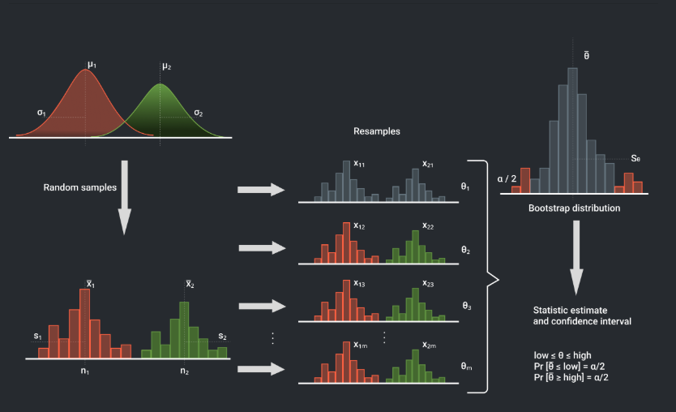

# Churn Rate: Bootstrap

Оценка доверительного интервала ROC-AUC для модели оттока пользователей с помощью бутстрепа.

## Проблема

При оценке модели классификации одной точечной метрики недостаточно. Важно понимать ответ на вопрос: **в каких пределах будет колебаться метрика ROC-AUC на новых данных?**

## Решение

**Bootstrap** - метод оценки доверительного интервала без знания распределения статистики.

Алгоритм:
1. Генерация N псевдовыборок из исходных данных 
2. Расчёт ROC-AUC на каждой выборке
3. Определение квантилей для LCB и UCB



## Основа -- задача в процессе  

```python

from sklearn.base import ClassifierMixin

def roc_auc_ci(
    classifier: ClassifierMixin, X: np.ndarray, y: np.ndarray, conf: float = 0.95, n_bootstraps: int = 10_000):
```

**Параметры:**
- `classifier` - обученный классификатор sklearn с методом `predict_proba`
- `X`, `y` - тестовая выборка
- `conf` - уровень доверия (default: 0.95)
- `n_bootstraps` - количество бутстреп-выборок

**Возвращает:** `(LCB, UCB)` — нижняя и верхняя границы доверительного интервала
