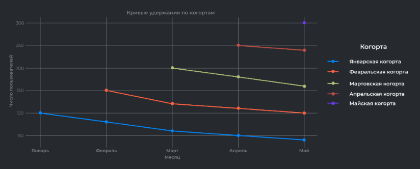
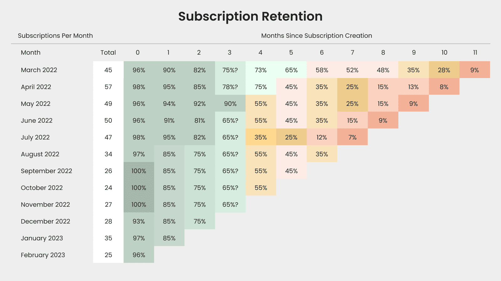

# Cohort Retention

Анализ удержания пользователей мобильного приложения PlantCare за 2024 год.

## Контекст

Во второй половине 2024 года наблюдался отток активных пользователей. Несмотря на рост новых установок, значительная часть аудитории перестала использовать приложение.

## Задача

Рассчитать Cohort Retention Rate - процент пользователей, продолжающих использовать продукт после регистрации.

**Критерии активности:** пользователь открыл приложение и использовал хотя бы одну ключевую функцию (заметки, карточки растений, напоминания, статьи, шеринг).

**Возможные причины:**
- Усиление конкуренции 
- Внедрение платной подписки в июле 2024 с ограничением ранее бесплатных функций

## Данные

| Таблица | Описание |
|---------|----------|
| `cr_users` | user_id, email, full_name, reg_date |
| `cr_user_actions` | action_id, user_id, action_date, action_type |

## Результат

SQL-запрос для расчёта retention rate по месячным когортам с разбивкой по календарным месяцам.

## Визуализация

**Retention curves**

Кривые удержания по когортам - наглядно показывают динамику оттока пользователей.

**Triangle chart (heatmap)**

Альтернативный способ визуализации - тепловая карта retention по когортам и месяцам.
