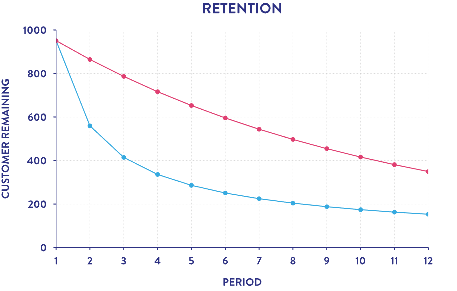

# Retention Rate Analysis

Анализ удержания пользователей для оценки Product Market Fit дейтингового приложения.



## Задача

Расчёт еженедельного Retention Rate - доли пользователей, продолжающих использовать приложение спустя N недель после регистрации.

## Данные

| Таблица | Описание |
|---------|----------|
| `retention_users` | user_id, username, registration_date |
| `retention_users_activity` | user_id, date, активность (logins, messages, likes и др.) |

## Метрика

```
Retention Rate = active_users / total_users
```

где `week` - порядковый номер недели с момента регистрации пользователя.

## Результат

| week | active_users | total_users | retention_percentage |
|------|--------------|-------------|----------------|
| 1    | 712          | 1000        | 0.712          |
| 2    | 538          | 1000        | 0.538          |
| ...  | ...          | ...         | ...            |
